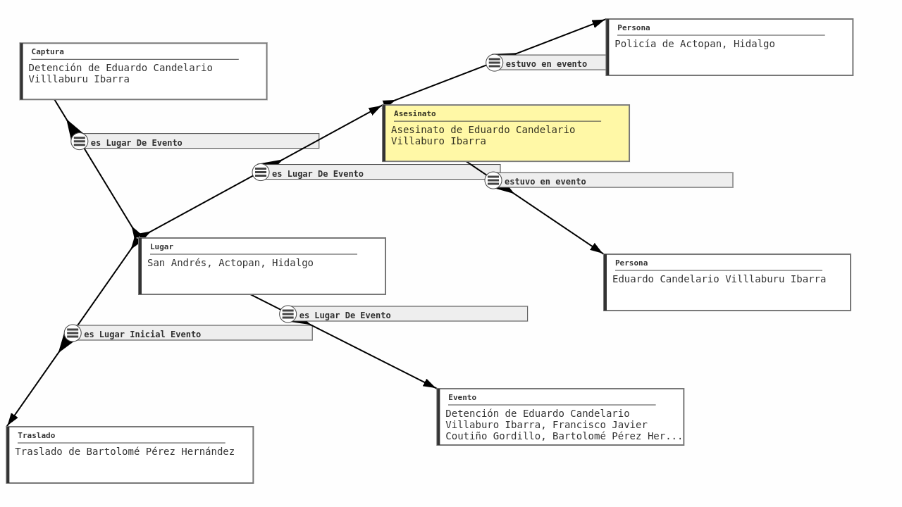

# Text2KG: Técnicas y aplicaciones de NLP y Bases de Datos de Gráficas.
#### Seminario de Ciencias de la Computación B - Facultad de Ciencias UNAM
A cargo de: **Dr. Víctor Mireles Chávez**, del Centro de Investigaciones Interdisciplinarias en Ciencias y Humanidades de la UNAM.

**Contacto**: 	[victor.mireles@ceiich.unam.mx](mailto:victor.mireles@ceiich.unam.mx)  
**Horario:** 	8:00 \- 9:00 hrs.  27 de Enero al 16 de Mayo 2025\.  
**Modalidad:** 	Híbrida (1 clase presencial a la semana, Facultad de Ciencias, UNAM)

## **¿De qué trata el curso?**

Es interesante ligar información estructurada con aquella contenida en documentos de texto. Por ejemplo, al leer un artículo periodístico es bueno tener a un click de distancia información sobre cada persona ahí mencionada, incluyendo sus ligas con otras personas, noticias y organizaciones. En este seminario se explorarán las técnicas de procesamiento de lenguaje natural (NLP),basadas en Redes Neuronales Artificiales, extracción de información, y representación del conocimiento necesarias para el diseño y construcción de un sistema que permita estas funcionalidades. Se familiarizará a las personas participantes con los conceptos necesarios en cada etapa y se implementarán prototipos que, al final del semestre, se combinarán para crear un sistema funcional. Los conjuntos de datos y los casos de uso vendrán de aplicaciones reales de interés social y cultural. 

En este seminario de carácter primordialmente práctico, los participantes elaborarán un sistema a partir de un conjunto de documentos, como el que se ejemplifica abajo y que se puede navegar en [https://visualizador.angeluscnb.mx/](https://visualizador.angeluscnb.mx/)

| |
| :---- |
| Ejemplo de una gráfica (red, o grafo) que contiene información sobre un caso de desaparición forzada. |

## **¿Cuáles son los objetivos?**

Las personas participantes podrán construir un sistema que convierta información textual en gráficas de conocimiento que sean navegables y consultables. Obtendrán familiaridad con una gama de paquetes de software libre y comerciales para las distintas etapas, y tendrán experiencia “hands on” en su despliegue, configuración e integración con software desarrollado durante el curso. En particular, obtendrán experiencia en:

1. Modelación de dominios usando lenguaje OWL  
2. Bases de datos de gráficas y sus lenguajes de consulta  
3. Técnicas de ligado de entidades usando modelos de lenguaje  
4. Generación de gráficas a partir de datos almacenados en tablas y en árboles json.

## **¿Qué temas se cubrirán?**

Para cada uno de los siguientes temas las personas participantes generarán un prototipo, desplegarán un sistema basado en software libre e integrarán ambos. Los prototipos desarrollados a lo largo del semestre se integrarán en la semana final y se presentarán.

1. **Representación del conocimiento por medio de gráficas**  
2. **Extracción de información de documentos textuales**  
3. **Poblamiento de bases de datos de gráficas**  
4. **Consulta de bases de datos de gráficas**

## **Programación Detallada:**

**I. Introduccion**

1. Información estructurada y no estructurada  
2. Paradigmas de consulta de información

**II. Representación del conocimiento por medio de gráficas**

3. Gráficas y multigráficas  
4. Ontologías computacionales  
5. Gráficas RDF  
6. Gráficas de propiedades  
7. Schema.org,  DCAT, SKOS y otras ontologías bien conocidas

**III. Extracción de información de documentos textuales**

8. Ligado de entidades (entity linking)  
9. Extracción de relaciones  
10. Búsqueda híbrida de texto y datos

**IV. Poblamiento de bases de datos de gráficas**

11. Generación de tripletas para gráficas RDF  
12. El sistema R2RML para transformar tablas en gráficas  
13. El sistema RML para transformar árboles json en gráficas

**V. Consulta de bases de datos de gráficas**

14. Patrones de subgráficas  
15. El lenguaje SPARQL  
16. El lenguaje Cypher

## **Evaluación:**

Las personas participantes elaborarán, individualmente o en equipos pequeños, a lo largo del semestre un proyecto a partir de una fuente de datos que sea de su interés. Se harán dos revisiones parciales del proyecto, al final de los módulos II y III, y una exposición final frente a clase donde se evaluará con los siguientes criterios:

1) Adecuado modelado del dominio usando una ontología  
2) Manejo adecuado de sistema de control de versiones Git con múltiples repositorios a la vez  
3) Presencia de criterios claros de evaluación de desempeño, y sus pruebas programáticas correspondientes  
4) Elección de componentes de software libre acordes al problema  
5) Conexión adecuada del sistema resultante con un sistema de visualización de gráficas.

## **Requisitos:**

Se prevén dos tipos de personas participantes. Para aquellas que prefieran contribuir a la construcción del sistema **desde el punto de vista técnico**, se recomienda familiaridad con:

* Programación en lenguaje Python  
* Uso de sistema de control de versiones Git  
* Teoría de gráficas básica.  
* Cálculo de predicados  
* Manejo de sistemas operativos unix (Linux o MacOS)

Para aquellas que quieran contribuir **desde el punto de vista de un caso de uso**, se recomienda tener en mente un problema basado en un conjunto de documentos digitales, tales como documentos de archivo, hemerográficos, testimonios, etc.
